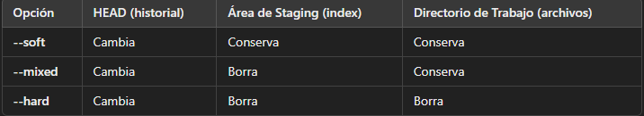

# Modificar y deshacer Commits
## Comandos
### Cambiar el nombre y descripcion de un commit
`git commit --amend`

Nos abre en VSC una pestania donde modificar esta info. **NO DEBE HABR NADA EN STAGING AREA**

### Cambiar el nombre y descripcion junto a los archivos que contiene un commit
`git commit --amend`

Todo lo que haya estado en Staging Area se cargo a este commit. Cabe aclarar que el hash cambia cada vez que usamos el amend. 

### Que es el HEAD
 Es siempre el ultimo commit, es un puntero que nos indica en que commit estamos parados. Esto nos dificulta al modificar commits anteriores al ultimo, por lo que se recomienda modificar SOLAMENTE el ultimo commit.

### Como deshacer un commit
Para borrar un commit tengo 3 formas

**SOFT =** Hay que poner el puntero en el commit a eliminar. Esto nos borra los commits superiores al que ahora tiene el puntero, tambien deja todos los archivos de los commits elimiandos al Staging Area.

`git reset --soft numeroDeHash`

`git reset --soft e21445dd43`

**MIXED =** Borra el commit, nos borra lo que habia en el Staging Area, pero no lo que estaba en Working Directory 

`git reset --mixed numeroDeHash`

`git reset --mixed e21445dd43`

**HARD =** Borra absolutamente el commit y todos los archivos que estaban dentro, borra el Staging Area y el Working Directory

`git reset --hard numeroDeHash`

`git reset --hard e21445dd43`

