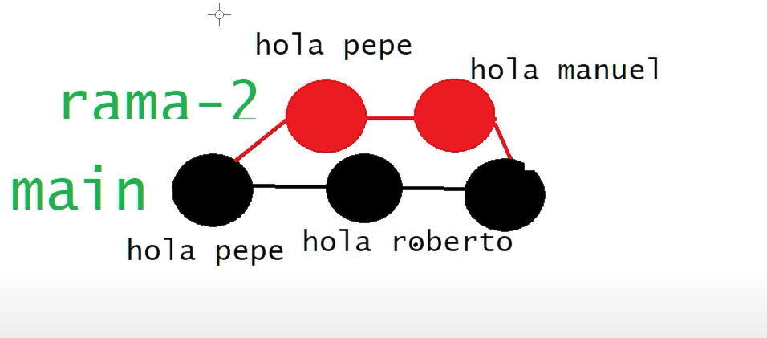

# Merge Conflicts 
No son errores, lo que sucede, es que GIT no sabe como fusionar las ramas y nos va a pedir que le especifiquemos como debe hacerlo     

Un merge conflict se ve asi, pasada la apertura de una nueva rama, nos hacen un nuevo cambio en la rama raiz de la que sale la anterior, por lo que **ese commit no quedo en la nueva rama**. Al unirlos, nos topamos con que nos faltan cambios en la rama nueva, por lo que GIT nos ofrece formas de resolverlo.

Asi se ve un grafico de merge conflict.

## Comandos

### Ver todos los commits sin importar la rama en la que estemos
`git log --oneline --all`

### Solucionar el merge conflict
Se intenta realizar la fusion con:

`git merge nombre-rama`

Pero GIT la rebota y nos informa del merge conflict y nos manda a VSC para resolverlo. Ahora tenemos la posibilidad de elegir que
1. aceptar el cambio que nos trae la rama auxiliar
2. aceptar el cambio que tiene la rama main
3. no aceptar ninguno de los dos cambios y quedarse sin las modificaciones
4. aceptar una combinacion de ambas
